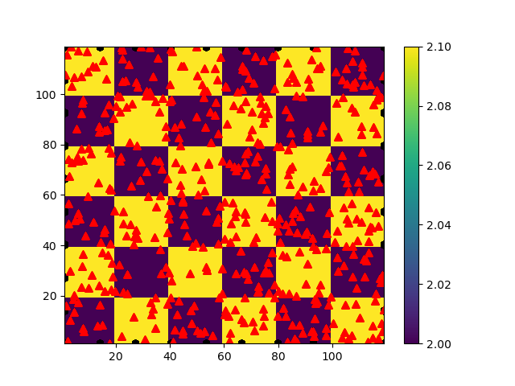
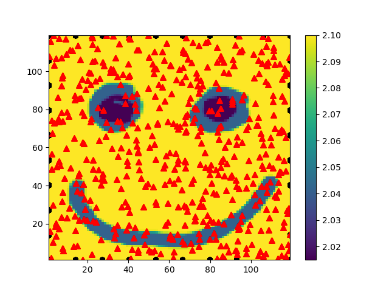
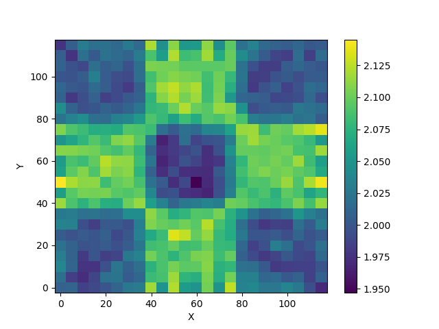

# TomoFMpy

TomoFMpy is a small research code for forward modelling and inverting seismic traveltimes in two dimensions.  It uses the Eikonal equation to compute first-arrival travel times through a velocity model and provides tools for building synthetic data sets as well as for performing linearized traveltime inversion.

---

## Table of Contents

1. [Overview](#overview)
2. [Installation](#installation)
3. [Repository Structure](#repository-structure)
4. [Synthetic Data Generation](#synthetic-data-generation)
5. [Eikonal Solver](#eikonal-solver)
6. [Traveltime Inversion](#traveltime-inversion)
7. [Configuration Files](#configuration-files)
8. [Figures](#figures)
9. [Testing](#testing)
10. [License](#license)
11. [Acknowledgments](#acknowledgments)

---

## Overview

TomoFMpy solves the **Eikonal equation**

\[ \left|\nabla T(x,y)\right| = \frac{1}{v(x,y)} \]

on a regular grid, where `T` is traveltime and `v` is the seismic velocity.  Given a velocity model, source locations and receiver locations, the package calculates traveltimes and optionally inverts for `v` using linearized least squares with optional regularization.

The inversion minimizes the cost function

\[
\phi(m) =  {r^{\top} C_{d} r + \epsilon\,\Vert m-m_{0}\Vert^{2} + \eta\, m^{\top} D m }
\]

where `r` are traveltime residuals, `C_d` is the data covariance, `m` is the model vector, `m_0` a starting model, and `D` the 2D discrete Laplacian matrix.  The parameters $\epsilon$ and $\eta$ control the perturbation and roughness penalties respectively.

## Installation

1. Clone this repository

   ```bash
   git clone https://github.com/timkomate/tomofmpy.git
   cd tomofmpy
   ```

2. Install the Python requirements

   ```bash
   pip install -r requirements.txt
   ```

## Repository Structure

```
configs/          Example configuration files
images/           Placeholder for figures used in this README
tests/            Pytest unit tests
README.md         Project documentation
setup.py          Packaging information
tomoFMpy/         Python source code
```

The main modules inside `tomoFMpy` are:

- `synthetic_data.py` – utilities to build synthetic velocity models and source/receiver geometries.
- `inversion.py` – command line interface for performing traveltime inversion on real data.
- `core/solver.py` – wrapper around `fteikpy.Eikonal2D` for computing traveltimes.
- `core/inversion.py` – linearized inversion driver implementing the cost function above.
- `utils/` – small helper modules for I/O, plotting and configuration parsing.

## Configuration files

TomoFMpy uses configuration files in `INI` format. Example templates are
located in the `configs` folder. Two configurations are provided:

1. `synthetic_config.ini` for creating synthetic measurements.
2. `inversion.ini` for running the inversion on an existing data set.

Both files share a similar structure with named sections and `key = value`
pairs. Below is an overview of the most important options.

### Synthetic data (`synthetic_config.ini`)

The options in this file control the geometry and the velocity model used to
generate synthetic traveltimes.  The main sections and their parameters are:

- **[geometry]**
  - `y`: Dimensions of the grid along the y-axis.
  - `x`: Dimensions of the grid along the x-axis.
  - `xmin`: Minimum value for x-coordinate.
  - `xmax`: Maximum value for x-coordinate.
  - `ymin`: Minimum value for y-coordinate.
  - `ymax`: Maximum value for y-coordinate.
  - `r`: Number of receiver points.
  - `nsrc`: Number of source points.
  - `latlon`: Whether to use latitude/longitude coordinates (True/False).
  - `plot`: Whether to plot the generated geometry (True/False).

- **[velocity_model]**
  - `method`: Method for generating the velocity model (checkerboard or image).
  - `dv`: Velocity increment.
  - `v0`: Starting velocity.
  - `tile_size`: Checkerboard tile size (required if using the checkerboard method)
  - `image_path`: Path to the image file (required if using the image method).

- **[general]**
  - `seed`: Seed for the random number generator.
  - `fname`: Output file name for the generated synthetic dataset.
  - `noise`: Standard deviation gaussian noise added to the synthetic traveltime.

## Synthetic Data Generation

The script `tomoFMpy/synthetic_data.py` can create a velocity model and random geometry for testing.  Two options are available:

1. **Checkerboard model** – alternating high and low velocity tiles.
2. **Image based model** – convert pixel values from an image into velocities.

Example usage:

```bash
python -m tomoFMpy.synthetic_data --config configs/synthetic_config.ini
```

A minimal measurement CSV for this script could contain:

```csv
source_id,xs,ys,xr,yr,tt,sigma
0,0.0,0.0,1.0,1.0,0.5,0.01
```

Set `latlon=True` in the configuration to use `lons,lats,lonr,latr` columns
instead of `xs,ys,xr,yr`.

## Eikonal Solver

`core/solver.py` subclasses `fteikpy.Eikonal2D`.  It reads a CSV file containing measurement geometry and optional observed traveltimes.  Stations may be specified either in local Cartesian coordinates (`xs`, `ys`, `xr`, `yr`) or in geographic coordinates (`lons`, `lats`, `lonr`, `latr`).  Geographic data are transformed to local coordinates using an azimuthal equal–area projection.

After setting up the grid spacing, calling `solve()` computes the traveltime field for each unique source.  Traveltimes at receiver positions are then extracted with `calculate_traveltimes()`.  Gaussian noise can be added via `add_noise()` for synthetic experiments.

1. **Checkerboard Model Example**

   

   Figure 1: Generated checkerboard velocity field used for the forward problem.

2. **Image based Model Example**

   

   Figure 2: Image based velocity field used for the forward problem.

## Traveltime Inversion

### Inversion (`inversion.ini`)

This configuration defines the parameters for the traveltime inversion itself.

- **[inversion]**
  - `measurements`: Path to the CSV file containing observed travel times.
  - `output`: Folder where inversion results will be saved.
  - `epsilon`: Weight for the damping (model perturbation) term.
  - `eta`: Weight for the roughness regularization term.
  - `use_start_file`: Set to `True` to initialize with `start_model` instead of `start_const`.
  - `start_model`: Optional CSV file with a starting model.
  - `start_const`: Constant starting value when no file is provided.
  - `method`: Optimization method passed to `scipy.optimize.minimize`.
  - `maxiter`: Maximum number of iterations of the minimizer.

- **[geometry]**
  - `y`, `x`: Physical dimensions of the model (km).
  - `ny`, `nx`: Number of grid nodes along each axis.
  - `latlon`: Treat coordinates as latitude/longitude if `True`.
  - `bl_lon`, `bl_lat`: Bottom-left corner coordinates when using lat/lon.

The class `core.inversion.Eikonal_Inversion` implements a simple linearized inversion.  After supplying a starting model with `add_starting_model()`, call `run_linear()` to minimise the misfit using `scipy.optimize.minimize`.  On each iteration the current model, an XYZ representation and a PNG image are written to the chosen output folder.  Residual history is also stored so it can be plotted later.

A typical command line invocation is:

```bash
python -m tomoFMpy.inversion --config configs/inversion.ini
```

The inversion configuration describes the grid size, location of the measurement CSV, regularization weights and optimisation method (e.g. L-BFGS-B).

1. **Checkerboard Model Inversion Example**

   

   *Figure 3: The resulting inverted velocity field from the 2D linearized inversion.*

## Quick Start

Run the following commands to get started:

1. Generate synthetic data:

   ```bash
   python -m tomoFMpy.synthetic_data --config configs/synthetic_config.ini
   ```

2. Run the inversion:

   ```bash
   python -m tomoFMpy.inversion --config configs/inversion.ini
   ```

3. View the results in the output directory specified in the inversion configuration.

## Testing

Unit tests are located in the `tests/` folder and require `pytest`.
Run them from the repository root with:

```bash
pytest -q
```

## License

This project is released under the terms of the MIT License.  See [LICENSE](LICENSE) for details.

## Acknowledgments

For questions or feedback please contact [timko.mate@gmail.com](mailto:timko.mate@gmail.com).
