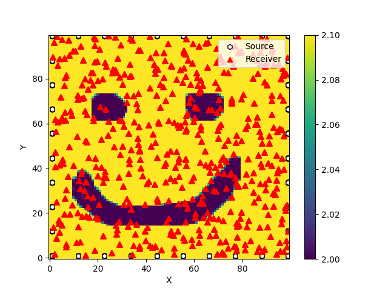

# TomoFMpy

TomoFMpy provides simple tools for generating synthetic traveltime data and performing 2‑D traveltime inversion using an Eikonal solver.

## Features

- Solve the Eikonal equation on a regular 2‑D grid.
- Build velocity models from a checkerboard pattern or an image.
- Create random source/receiver geometry and add Gaussian noise.
- Linearised and global optimisation routines for velocity inversion.

## Prerequisites

- Python 3.7 or newer
- Required packages listed in `requirements.txt`

## Installation

```bash
git clone https://github.com/timkomate/tomofmpy.git
cd tomofmpy
pip install -r requirements.txt
```

## Generating synthetic data

The `synthetic_data.py` script creates a velocity model and computes traveltimes
according to the options in `configs/synthetic_config.ini`.

```bash
python synthetic_data.py --config configs/synthetic_config.ini
```

Output traveltimes and geometry are written to the file name specified in the
configuration file.




## Traveltime inversion

The example script `main.py` fits a velocity model to a set of synthetic
traveltimes:

```bash
python main.py
```

For real data the `main_realdata.py` script reads coordinates and traveltimes
from CSV files and performs the same inversion workflow.

## Configuration file

The `synthetic_config.ini` file controls grid size, velocity generation and
output paths. Key options are:

- **geometry** – grid dimensions, coordinate limits, number of sources and
  receivers, and whether geographic coordinates are used.
- **velocity_model** – choose `checkerboard` or `image` and set `dv`, `v0`,
  `tile_size` or `image_path` accordingly.
- **general** – random seed, output filename and Gaussian noise level added to
  the traveltimes.

## License

This project is licensed under the MIT License.

## Contact

Questions or issues can be directed to
[timko.mate@gmail.com](mailto:timko.mate@gmail.com).
